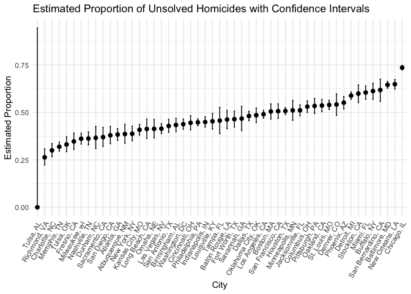
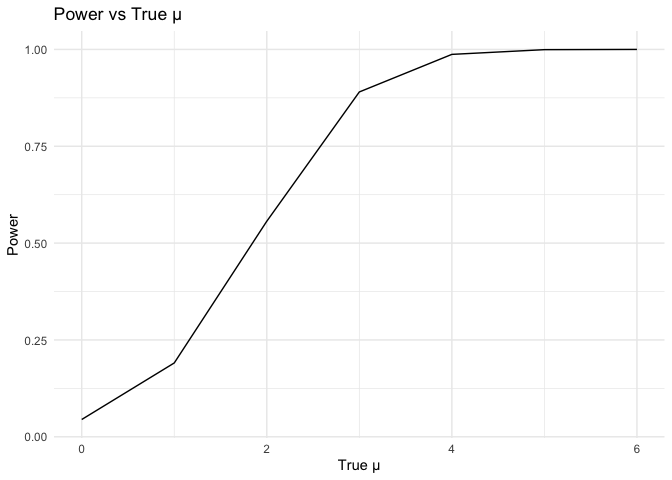

p8105_hw5_jx2562
================
Jingyi
2023-11-13

``` r
library(tidyverse)
library(purrr)
```

## Problem 1

Load the homicides dataset. Categorized the raw data by cites and
summarize the total number of homicides and the number of unsolved
homicides

``` r
homicide_df = read_csv("data/homicide-data.csv") |>
  mutate(city_state = paste(city, state, sep = ", ")) |>
  group_by(city_state) |>
  summarise(total_homicides = n(),
            unsolved_homicides = sum(disposition %in% c("Closed without arrest", "Open/No arrest")))
```

    ## Rows: 52179 Columns: 12
    ## ── Column specification ────────────────────────────────────────────────────────
    ## Delimiter: ","
    ## chr (9): uid, victim_last, victim_first, victim_race, victim_age, victim_sex...
    ## dbl (3): reported_date, lat, lon
    ## 
    ## ℹ Use `spec()` to retrieve the full column specification for this data.
    ## ℹ Specify the column types or set `show_col_types = FALSE` to quiet this message.

Here we have a data frame which describe the total number of homicide in
the cities and the number of unsolved homicides in the cities.

Now, we estimate the proportion of homicides that are unsolved in
Baltimore, MD.

``` r
baltimore_data = homicide_df |>
  filter(city_state == "Baltimore, MD") 

baltimore_test = prop.test(pull(baltimore_data, unsolved_homicides), pull(baltimore_data, total_homicides)) |>
  broom::tidy()

print(paste("Estimated proportion for Baltimore: ", round(baltimore_test$estimate[1], 4)))
```

    ## [1] "Estimated proportion for Baltimore:  0.6456"

``` r
print(paste("Confidence interval for Baltimore: ", round(baltimore_test$conf.low, 4), "-", round(baltimore_test$conf.high, 4)))
```

    ## [1] "Confidence interval for Baltimore:  0.6276 - 0.6632"

Given the above pipeline, we can create a workflow to calculate the
estimate proportions and CIs for each cities.

``` r
run_prop_test <- function(city) {
  data <- homicide_df |>
    filter(city_state == city) 
  
  prop_test_result <- prop.test(pull(data, unsolved_homicides), pull(data, total_homicides))
  tidy_result <- broom::tidy(prop_test_result)
  
  tibble(
    estimated_proportion = tidy_result$estimate[1],
    conf_low = tidy_result$conf.low,
    conf_high = tidy_result$conf.high
  )
}
```

``` r
unsolved_prop <- homicide_df |>
  mutate(prop_test_results = map(city_state, run_prop_test)) |>
  unnest()

head(unsolved_prop)
```

    ## # A tibble: 6 × 6
    ##   city_state    total_homicides unsolved_homicides estimated_proportion conf_low
    ##   <chr>                   <int>              <int>                <dbl>    <dbl>
    ## 1 Albuquerque,…             378                146                0.386    0.337
    ## 2 Atlanta, GA               973                373                0.383    0.353
    ## 3 Baltimore, MD            2827               1825                0.646    0.628
    ## 4 Baton Rouge,…             424                196                0.462    0.414
    ## 5 Birmingham, …             800                347                0.434    0.399
    ## 6 Boston, MA                614                310                0.505    0.465
    ## # ℹ 1 more variable: conf_high <dbl>

The `unsolved_prop` data frame present the estimated proportion and CIs
for unsolved homicides in each city, along with the raw total count of
homicides and unsolved homicides.

Now we draw a plot that shows the estimates and CIs for each city.

``` r
unsolved_prop$city_state <- factor(unsolved_prop$city_state,  levels=unsolved_prop$city_state[order(unsolved_prop$estimated_proportion)])

ggplot(unsolved_prop, aes(x = city_state, y = estimated_proportion, ymin = conf_low, ymax = conf_high)) +
  geom_point(size = 2) +
  geom_errorbar(width = 0.2, position = position_dodge(0.2)) +
  labs(title = "Estimated Proportion of Unsolved Homicides with Confidence Intervals",
       x = "City",
       y = "Estimated Proportion") +
  theme_minimal() +
  theme(axis.text.x = element_text(angle = 60, hjust = 1))
```

<!-- -->

As the plot shows, **Tulsa, AL** shows the lowest estimated proportion
of unsolved homicides case as well as the highest error bar. The small
sample size may lead to the result. At the meantime, **Chicago, IL**
shows the highest estimated proportion and a very narrow error bar,
which may caused by a large sample size.

## Problem 2

In this problem, we combine the control data and experimental data in
separate files into one tidy dataframe.

``` r
file_names <- list.files(path = "data/problem 2", full.names = TRUE)

study_df <- tibble(file = file_names)|>
  mutate(
    subject_id = tools::file_path_sans_ext(basename(file)),
    arm = str_extract(basename(file), "(con|exp)")
  ) |>
  mutate(data = map(file, read_csv)) |>
  unnest(data) |>
  select(subject_id, arm, everything(),-file)
```

``` r
head(study_df)
```

    ## # A tibble: 6 × 10
    ##   subject_id arm   week_1 week_2 week_3 week_4 week_5 week_6 week_7 week_8
    ##   <chr>      <chr>  <dbl>  <dbl>  <dbl>  <dbl>  <dbl>  <dbl>  <dbl>  <dbl>
    ## 1 con_01     con     0.2   -1.31   0.66   1.96   0.23   1.09   0.05   1.94
    ## 2 con_02     con     1.13  -0.88   1.07   0.17  -0.83  -0.31   1.58   0.44
    ## 3 con_03     con     1.77   3.11   2.22   3.26   3.31   0.89   1.88   1.01
    ## 4 con_04     con     1.04   3.66   1.22   2.33   1.47   2.7    1.87   1.66
    ## 5 con_05     con     0.47  -0.58  -0.09  -1.37  -0.32  -2.17   0.45   0.48
    ## 6 con_06     con     2.37   2.5    1.59  -0.16   2.08   3.07   0.78   2.35

Here we summarize the observations of each study subjects into one tidy
data frame, with arms specified.

``` r
study_df_long = study_df |>
  pivot_longer(cols = starts_with("week"), names_to = "week", values_to = "observation") 

ggplot(study_df_long, aes(x = as.factor(week), y = observation, group = subject_id, color = arm)) +
  geom_line() +
  labs(title = "Spaghetti Plot of Observations Over Time",
       x = "Week",
       y = "Observation") +
  theme_minimal()
```

<!-- --> As
we can see from the plot, experiment group generally has a larger values
in observation than the control group. The differences is not so
apparent until week 6. Exception appears in two of the experiment
groups, in which they bypass the control group at the first week. Also,
the experiment group shows a tendency of increase, while it shows
moderate fluctuations around the center.

## Problem 3

This question aims to simulate data for a one-sample t-test, estimating
the mean and p-value, and then calculating the power based on the
simulated datasets.

``` r
set.seed(123)
```

Set designed elements.

``` r
n <- 30
sigma <- 5
alpha <- 0.05
true_mu_values <- c(0, 1, 2, 3, 4, 5, 6)
simulations <- 5000
```

Set a function to simulate and test the data.

``` r
simulate_and_test <- function(true_mu) {
  # Generate datasets and perform t-test
  results <- replicate(simulations, {
    datasets <- tibble(
      x = rnorm(n, mean = true_mu, sd = sigma)
    )
    t_test_result <- broom::tidy(t.test(datasets$x, mu = 0))
    return(tibble(
      true_mu = true_mu,
      estimate = t_test_result$estimate,
      p_value = t_test_result$p.value
    ))
  }, simplify = FALSE)
  
  # Combine the results from replicate
  bind_rows(results, .id = "simulation")
}
```

Run stimulation and test on data sets with different mu values.

``` r
# Run simulations for different true_mu values
simulation_results <- map_dfr(true_mu_values, simulate_and_test)

# Add a column to indicate whether null hypothesis was rejected
simulation_results <- simulation_results |>
  mutate(null_rejected = p_value < alpha)
```

Visualization:

**Plot 1:** Power vs True mean

``` r
power_plot <- simulation_results |>
  group_by(true_mu) |>
  summarise(power = mean(null_rejected)) |>
  ggplot(aes(x = true_mu, y = power)) +
  geom_line() +
  labs(title = "Power vs True μ",
       x = "True μ",
       y = "Power") +
  theme_minimal()

# Show the power plot
print(power_plot)
```

<!-- -->

As we can observe, as the true mean increase, the power of the test also
increase. A sudden rise appears for true mean between 1 and 3.

**Plot 2:** Average Estimate of mean vs True mean

``` r
avg_estimate_plot <- simulation_results |>
  group_by(true_mu) |>
  summarise(avg_estimate = mean(estimate)) |>
  ggplot(aes(x = true_mu, y = avg_estimate)) +
  geom_line() +
  labs(title = "Average Estimate of μ̂ vs True μ",
       x = "True μ",
       y = "Average Estimate") +
  theme_minimal()

# Show the average estimate plot
print(avg_estimate_plot)
```

<!-- -->
The plot shows a clear positive relation ship between true mean and the
estimated mean. To a certain extent, the estimated mean extremely
approaches the true mean, indicating that the estimator is unbiased on
average.

**Plot 3:** Average Estimate of mean in Rejected Samples vs True mean

``` r
avg_estimate_rejected_plot <- simulation_results |>
  filter(null_rejected) |>
  group_by(true_mu) |>
  summarise(avg_estimate_rejected = mean(estimate)) |>
  ggplot(aes(x = true_mu, y = avg_estimate_rejected)) +
  geom_line() +
  labs(title = "Average Estimate of μ̂ in Rejected Samples vs True μ",
       x = "True μ",
       y = "Average Estimate in Rejected Samples") +
  theme_minimal()

# Show the average estimate in rejected samples plot
print(avg_estimate_rejected_plot)
```

<!-- -->
Different from the above graph, in samples where the null hypothesis is
rejected, the average estimate of mean tends to be higher than the true
mean, especially for smaller samples with true means. This is called
*Winner’s curse*. This is because the sample that produced a significant
result is likely to be one where the observed effect is larger than
average due to random variability.

However, for a larger true mean (4, 5, 6) the estimated mean for
rejected samples is approximately equal to the true value of mean. Even
though the Winner’s Curse effect might still be present, the impact is
less pronounced because the signal (difference from the null hypothesis)
is more robust. In cases where the true mean is large, the signal stands
out more clearly from random variability, leading to more accurate
estimates even in samples where the null hypothesis is rejected.
